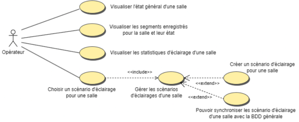
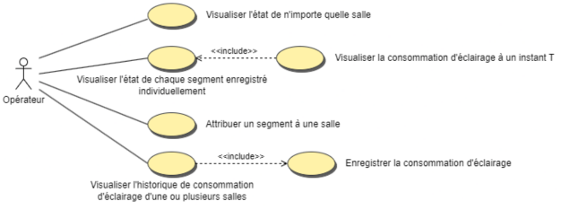
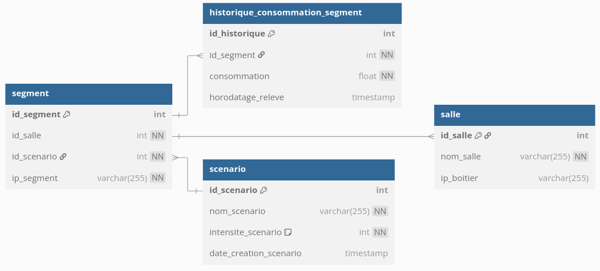
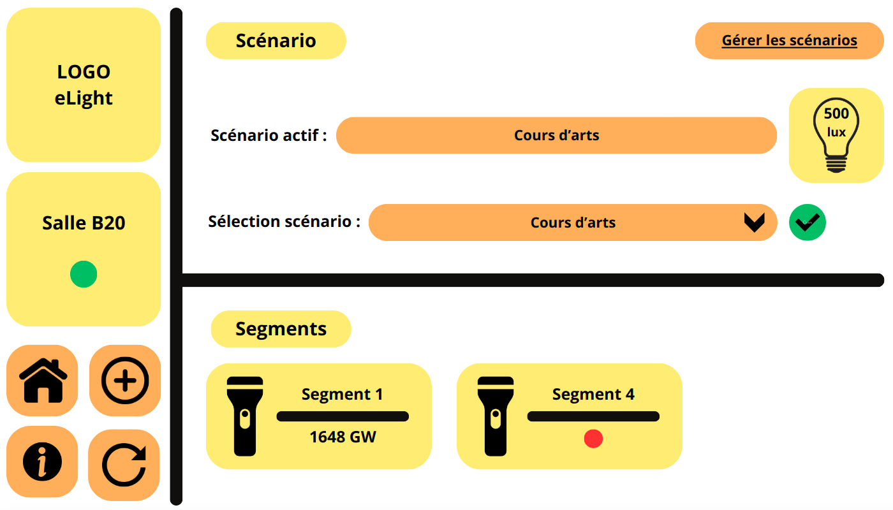
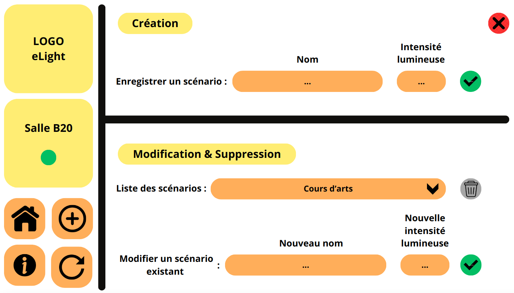
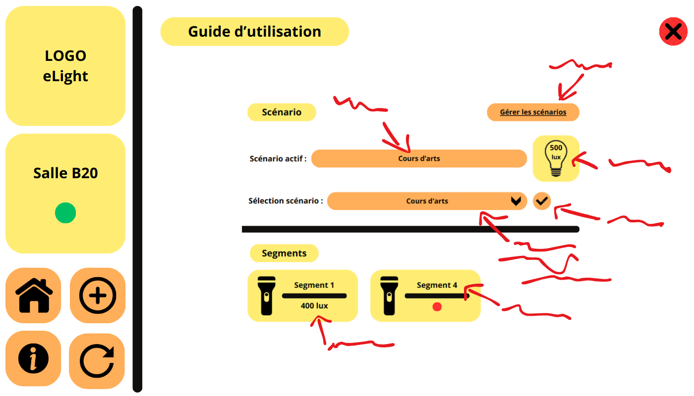

# Projet eLight 💡

- [Projet eLight 💡](#projet-elight-)
  - [Présentation](#présentation)
    - [Module de gestion par salle](#module-de-gestion-par-salle)
    - [Module de supervision](#module-de-supervision)
  - [Itérations](#itérations)
    - [Itération 1](#itération-1)
    - [Itérations 2](#itérations-2)
    - [Itérations 3](#itérations-3)
    - [Itérations 4](#itérations-4)
  - [Recette](#recette)
    - [Recette - Module de gestion par salle](#recette---module-de-gestion-par-salle)
    - [Recette - Module de supervision](#recette---module-de-supervision)
  - [Diagrammes](#diagrammes)
    - [Diagrammes de cas d'utilisation - Module de gestion par salle](#diagrammes-de-cas-dutilisation---module-de-gestion-par-salle)
    - [Diagrammes de cas d'utilisation - Module de supervision](#diagrammes-de-cas-dutilisation---module-de-supervision)
  - [Base de données](#base-de-données)
  - [Utilisation](#utilisation)
  - [Maquettes](#maquettes)
    - [IHM - Module de gestion par salle](#ihm---module-de-gestion-par-salle)
      - [Page d'accueil](#page-daccueil)
      - [Page gestion des scénarios](#page-gestion-des-scénarios)
      - [Page guide d'utilisation](#page-guide-dutilisation)
  - [Changelog](#changelog)
  - [Documentation](#documentation)
  - [Créateurs](#créateurs)

---

## Présentation

Le projet eLight vise à optimiser l'éclairage des structures telles que les supermarchés, entrepôts et salles de classe en ajustant la lumière en fonction des besoins réels des occupants. Grâce à des capteurs de luminosité et un contrôle intelligent, il permet de réaliser des économies d'énergie tout en garantissant un confort visuel optimal.

### Module de gestion par salle

Ce module permet au client de gérer l’éclairage d’une salle. Il peut ainsi choisir un scénario d’éclairage, visualiser la consommation en cours, créer un nouveau scénario pour sa salle et gérer les scénarios existants. Il envoie des instructions aux modules contrôleur de segment.

### Module de supervision

Ce module permet au client de superviser toutes les salles équipées de système elight. Il peut visualiser les états de tous les segments, gérer les scénarios de toutes les salles, gérer les attributions de segment à une salle, suivre la consommation de toute l’installation à l’instant T et visualiser l’historique des consommations pour toute l’installation.

## Itérations

### Itération 1

- **Créer des scénarios** : L'utilisateur peut créer un scénario.
- **Supprimer des scénarios** : L'utilisateur peut supprimer un scénario.
- **Mettre à jour des scénarios** : L'utilisateur peut mettre à jour un scénario.
- **Afficher les scénarios enregistrés** : L'utilisateur peut visualiser les scénarios disponibles.

### Itérations 2

- **Sélectionner un scénario** : L'utilisateur peut sélectionner pour la salle.
- **Afficher le scénario actif** : L'utilisateur peut visualiser le scénario actif de la salle.
- **Afficher la consommation des segments** : L'utilisateur peut visualiser la consommation des segments dans la salle.

### Itérations 3

- **Afficher la consommation instantanée** : L'utilisateur peut voir la consommation à un instant T via l'application de supervision.
- **Afficher une page de guide** : L'utilisateur peut accéder à une page d'aide.

### Itérations 4

- **Interface graphique revisitée** : Amélioration de l'interface graphique.

## Recette

### Recette - Module de gestion par salle

- [ ] La salle à gérer est paramétrable
- [ ] L’état générale de la salle est consultable
- [ ] Les segments de la salle et leur état sont visualisables
- [ ] Un scénario est sélectionnable pour la salle
- [ ] La création d’un scénario pour la salle est possible
- [ ] La gestion des scénarios est possible
- [ ] La synchronisation des scénarios avec la BDD centrale est possible
- [ ] La liaison sans fil est opérationnelle

**Production attendue :**

- [ ] Une application informatique fonctionnelle ;
- [ ] Un modèle UML complet de la partie à développer ;
- [ ] Le code source commenté de l'application ;
- [ ] Les documentations associées au module.

### Recette - Module de supervision

- [ ] L’état de n’importe quelle salle est affichable
- [ ] L’édition des informations associées à une salle est possible
- [ ] L‘état de n’importe quel segment est affichable
- [ ] L’assignation d’un segment à une salle est possible
- [ ] Tous les scénarios d’éclairage sont gérables
- [ ] La consommation d’éclairage est visible à l’instant T
- [ ] L’historique des consommations d’éclairage est visualisable
- [ ] La liaison sans fil est opérationnelle

**Production attendue :**

- [ ] Une application informatique fonctionnelle ;
- [ ] Un modèle UML complet de la partie à développer ;
- [ ] Le code source commenté de l'application ;
- [ ] Les documentations associées au module.

## Diagrammes

### Diagrammes de cas d'utilisation - Module de gestion par salle

### Diagrammes de cas d'utilisation - Module de supervision

## Base de données

> TODO

## Utilisation

> TODO

## Maquettes

### IHM - Module de gestion par salle

#### Page d'accueil

#### Page gestion des scénarios

#### Page guide d'utilisation

## Changelog

> TODO

## Documentation

> TODO

## Créateurs

- **[Soria Bonet Enzo](https://github.com/esoriabonet)** : *Module de gestion par salle*
- **[Blondel Joshua](https://github.com/JBLONDEL04)** : *Module de supervision*
