<table style="width:100%">
    <tr>
        <th colspan="3">eLight</th>
    </tr>
    <tr>
        <td>
        
        </td>
        <td>
        
        </td>
        <td>
        
        </td>
    </tr>
</table>
<table style="width:100%">
    <tr>
        <th colspan="2">GitHub Actions</th>
    </tr>
    <tr>
        <td>
        
        </td>
        <td>
        
        </td>
    </tr>
</table>

# Projet BTS CIEL 2025 : eLight 💡

- [Projet BTS CIEL 2025 : eLight 💡](#projet-bts-ciel-2025--elight-)
  - [Présentation](#présentation)
    - [Module de gestion par salle](#module-de-gestion-par-salle)
    - [Module de supervision](#module-de-supervision)
  - [Gestion de projet](#gestion-de-projet)
    - [Itération 1](#itération-1)
    - [Itération 2](#itération-2)
    - [Itération 3](#itération-3)
    - [Itération 4](#itération-4)
  - [Recette](#recette)
    - [Module de gestion par salle](#module-de-gestion-par-salle-1)
    - [Module de supervision](#module-de-supervision-1)
  - [Diagrammes](#diagrammes)
    - [Diagrammes de cas d'utilisation - Module de gestion par salle](#diagrammes-de-cas-dutilisation---module-de-gestion-par-salle)
    - [Diagrammes de cas d'utilisation - Module de supervision](#diagrammes-de-cas-dutilisation---module-de-supervision)
  - [Base de données](#base-de-données)
  - [IHM - Module de gestion par salle](#ihm---module-de-gestion-par-salle)
    - [Page d'accueil](#page-daccueil)
    - [Page gestion des scénarios](#page-gestion-des-scénarios)
    - [Page guide d'utilisation](#page-guide-dutilisation)
  - [IHM - Module de supervision](#ihm---module-de-supervision)
    - [Page  d'accueil](#page--daccueil)
    - [Page d'information de salle](#page-dinformation-de-salle)
    - [Page d'édition de salle](#page-dédition-de-salle)
    - [Page de l'historique de consommation](#page-de-lhistorique-de-consommation)
  - [Diagramme de classes](#diagramme-de-classes)
    - [Module de gestion par salle](#module-de-gestion-par-salle-2)
    - [Module de supervision](#module-de-supervision-2)
  - [Protocole de communication](#protocole-de-communication)
  - [Changelog](#changelog)
    - [v1.0.0 - 2025-06-06](#v100---2025-06-06)
    - [Versions futures (à prévoir)](#versions-futures-à-prévoir)
  - [Créateurs](#créateurs)

---

## Présentation

Le projet eLight vise à optimiser l'éclairage des structures telles que les supermarchés, entrepôts et salles de classe en ajustant la lumière en fonction des besoins réels des occupants. Grâce à des capteurs de luminosité et un contrôle intelligent, il permet de réaliser des économies d'énergie tout en garantissant un confort visuel optimal.

### Module de gestion par salle

Ce module permet au client de gérer l’éclairage d’une salle. Il peut ainsi choisir un scénario d’éclairage, visualiser la consommation en cours, créer un nouveau scénario pour sa salle et gérer les scénarios existants. Il envoie des instructions aux modules contrôleur de segment.

### Module de supervision

Ce module permet au client de superviser toutes les salles équipées de système elight. Il peut visualiser les états de tous les segments, gérer les scénarios de toutes les salles, gérer les attributions de segment à une salle, suivre la consommation de toute l’installation à l’instant T et visualiser l’historique des consommations pour toute l’installation.

## Gestion de projet

[GitHub Project](https://github.com/orgs/bts-lasalle-avignon-projets/projects/28)

### Itération 1

- **Créer des scénarios** : L'utilisateur peut créer un scénario.
- **Supprimer des scénarios** : L'utilisateur peut supprimer un scénario.
- **Mettre à jour des scénarios** : L'utilisateur peut mettre à jour un scénario.
- **Afficher les scénarios enregistrés** : L'utilisateur peut visualiser les scénarios disponibles.

### Itération 2

- **Sélectionner un scénario** : L'utilisateur peut sélectionner pour la salle.
- **Afficher le scénario actif** : L'utilisateur peut visualiser le scénario actif de la salle.
- **Afficher la consommation des segments** : L'utilisateur peut visualiser la consommation des segments dans la salle.

### Itération 3

- **Afficher la consommation instantanée** : L'utilisateur peut voir la consommation à un instant T via l'application de supervision.
- **Afficher une page de guide** : L'utilisateur peut accéder à une page d'aide.

### Itération 4

- **Interface graphique revisitée** : Amélioration de l'interface graphique.

## Recette

### Module de gestion par salle

| Fonctionnalité                                                                | À faire | En cours | Achevé |
|-------------------------------------------------------------------------------| :-----: | :------: | :----: |
| La salle à gérer est paramétrable                                             |         |          | X      |
| L’état général de la salle est consultable                                    |         |          | X      |
| Les segments de la salle et leur état sont visualisables                      |         |          | X      |
| Un scénario est sélectionnable pour la salle                                  |         |          | X      |
| La création d’un scénario pour la salle est possible                          |         |          | X      |
| La gestion des scénarios est possible                                         |         |          | X      |
| La synchronisation des scénarios avec la BDD centrale est possible            |         |          | X      |
| La liaison sans fil est opérationnelle                                        |         |          | X      |

- Production attendue :

| Livrable                                      | À faire | En cours | Achevé |
|-----------------------------------------------| :-----: | :------: | :----: |
| Application informatique fonctionnelle        |         |          | X      |
| Modèle UML complet                            |         |          | X      |
| Code source commenté                          |         |          | X      |
| Documentations associées                      |         |          | X      |

### Module de supervision

| Fonctionnalité                                                                | À faire | En cours | Achevé |
|-------------------------------------------------------------------------------| :-----: | :------: | :----: |
| L’état de n’importe quelle salle est affichable                               |         |          | X      |
| L’édition des informations associées à une salle est possible                 |         |          | X      |
| L‘état de n’importe quel segment est affichable                               |         |          | X      |
| L’assignation d’un segment à une salle est possible                           |         |          | X      |
| Tous les scénarios d’éclairage sont gérables                                  |         |          | X      |
| La consommation d’éclairage est visible à l’instant T                         |         |          | X      |
| L’historique des consommations d’éclairage est visualisable                   |         |          | X      |
| La liaison sans fil est opérationnelle                                        |         | X        |        |

- Production attendue :

| Livrable                                      | À faire | En cours | Achevé |
|-----------------------------------------------| :-----: | :------: | :----: |
| Application informatique fonctionnelle        |         |          | X      |
| Modèle UML complet                            |         |          | X      |
| Code source commenté                          |         |          | X      |
| Documentations associées                      |         |          | X      |

## Diagrammes

### Diagrammes de cas d'utilisation - Module de gestion par salle

### Diagrammes de cas d'utilisation - Module de supervision

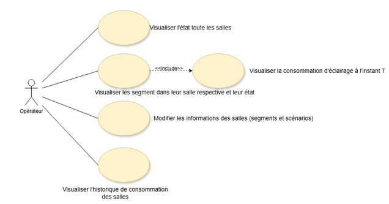

## Base de données

cf. [eLight.sql](./base-de-donnees/eLight.sql)

> [Guide d'installation](base-de-donnees/GUIDE-D-INSTALLATION.md)

## IHM - Module de gestion par salle

### Page d'accueil

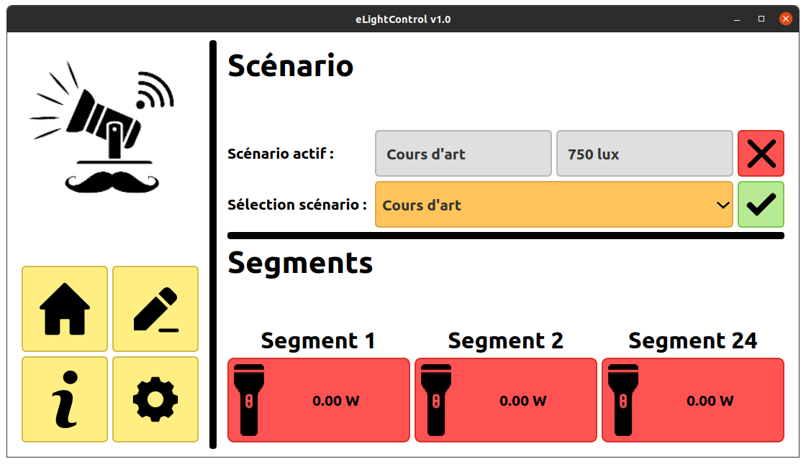

### Page gestion des scénarios

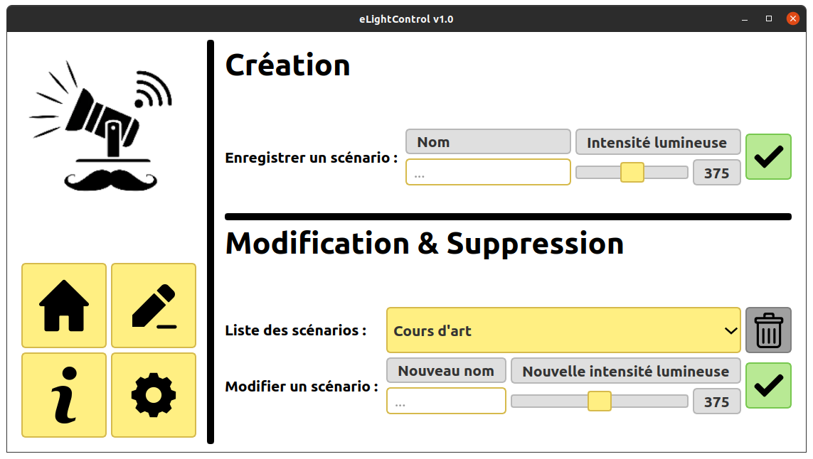

### Page guide d'utilisation

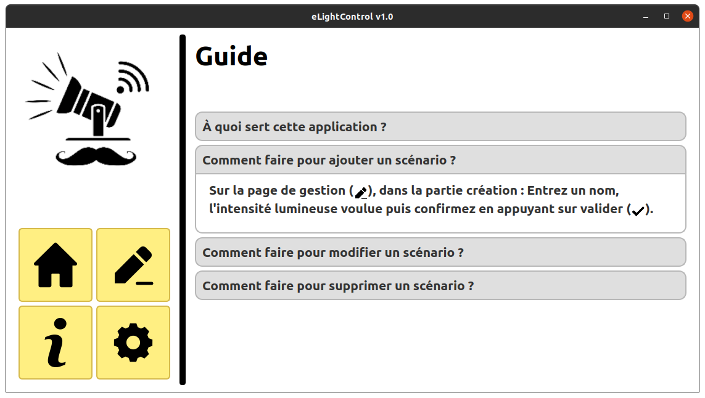

## IHM - Module de supervision

### Page  d'accueil

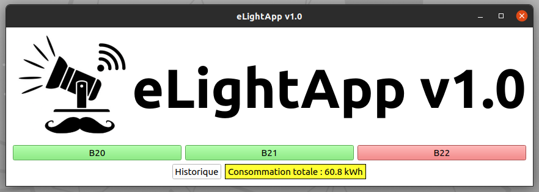

### Page d'information de salle

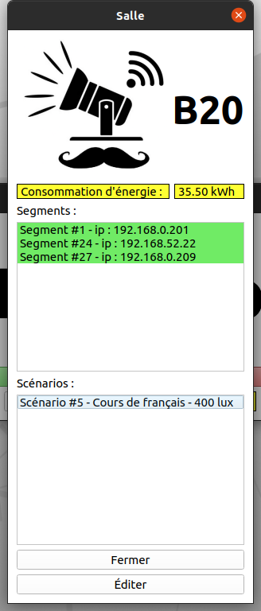

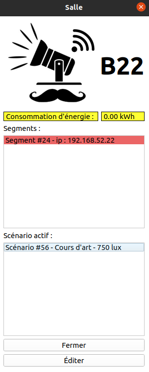

### Page d'édition de salle

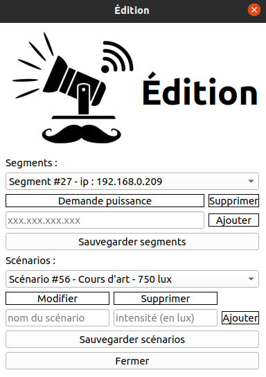

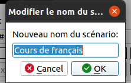

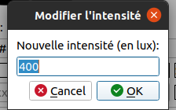

### Page de l'historique de consommation

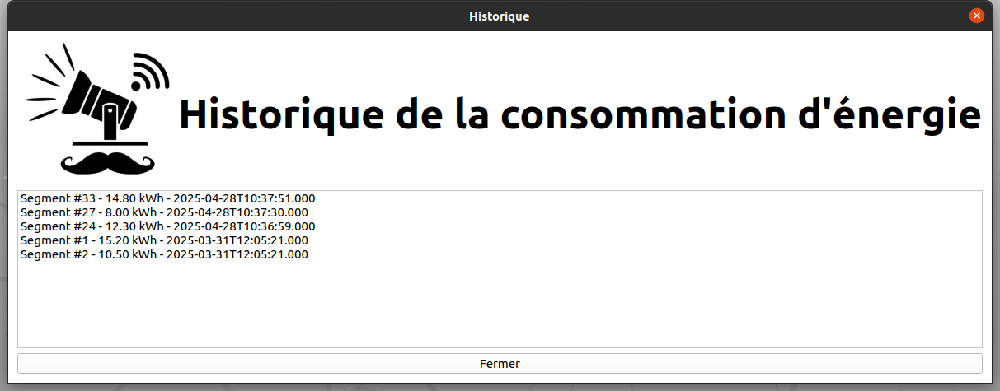

## Diagramme de classes

### Module de gestion par salle

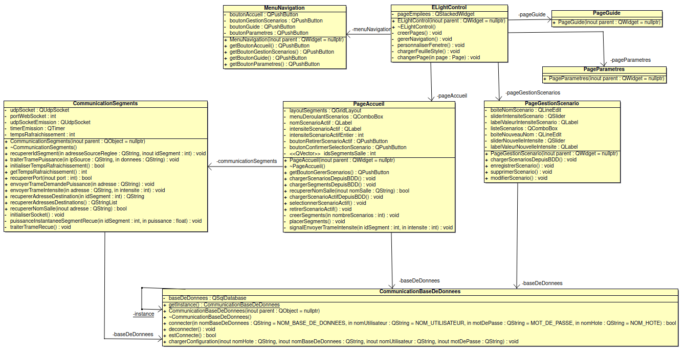

### Module de supervision

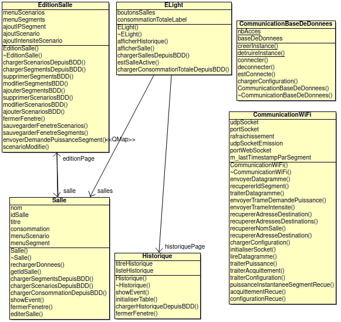

## Protocole de communication

Ce protocole permet l’échange de données entre une **application de gestion** (logiciel) et un **contrôleur de segment** (matériel), via une **trame normalisée transmise par Wi-Fi** utilisant le **protocole UDP**. Les deux modules utilisent le même protocole de communication.

Les trames suivent le format suivant : `#TYPE;DONNEE\r\n`

Chaque élément de la trame a un rôle précis :

| Nom       | Forme        | Description                                                                 | Exemple      |
|-----------|--------------|------------------------------------------------------------------------------|--------------|
| Début     | `#`          | Caractère de début de trame, sert à la **synchronisation**.                 | `#`          |
| Type      | `TYPE`       | Lettre indiquant **l’action à exécuter**.                                   | `P`, `I`, `A`|
| Séparateur| `;`          | Permet de **séparer** le type de la donnée utile.                           | `;`          |
| Donnée    | `DONNEE`     | Contenu utile, valeur numérique transmise.                                  | `300`        |
| Fin       | `\r\n`       | Fin de trame. Convention utilisée pour **délimiter** la fin du message.     | `\r\n`       |

- Types de trames :

| Nom du type | Forme     | Description                                                            | Exemple        |
|-------------|-----------|------------------------------------------------------------------------|----------------|
| Puissance (req) | `#P;0\r\n`  | Requête envoyée par l’application pour obtenir la **puissance instantanée** d’un segment. | `#P;0\r\n`     |
| Puissance (rep) | `#P;xxx\r\n`| Réponse envoyée par le segment avec la valeur de **puissance mesurée**.               | `#P;300\r\n`   |
| Intensité      | `#I;xxx\r\n`| Ordre envoyé à un segment pour appliquer une **intensité donnée**.                    | `#I;400\r\n`   |
| Accusé (ACK)   | `#A;0\r\n`  | Confirme la **réception d’une trame** ou indique la **fin de communication**.        | `#A;0\r\n`     |

> Bien que le protocole **UDP** soit rapide, il ne garantit **ni la réception ni l’ordre des paquets**.

Pour améliorer la fiabilité :

- Chaque trame de réponse envoyée par le **contrôleur** est attendue avec un **accusé de réception** (ACK) par l'application.
- En **l’absence d’ACK** dans un délai défini, la trame est **renvoyée automatiquement**.
- Ce mécanisme garantit une meilleure **sécurité applicative** et limite les **pertes de données**, notamment pour les mesures critiques (ex. puissance).

## Changelog

### v1.0.0 - 2025-06-06

- Implémentation complète des modules de gestion par salle et de supervision
- Fonctionnalités clés :
  - Création, suppression et gestion des scénarios d’éclairage
  - Supervision en temps réel des salles et segments
  - Visualisation de la consommation instantanée et historique
  - Interface utilisateur complète et ergonomique
- Base de données opérationnelle et synchronisée
- Documentation et modèles UML fournis

### Versions futures (à prévoir)

- Corrections de bugs mineurs
- Optimisations de la liaison sans fil
- Ajout possible de fonctionnalités avancées

## Créateurs

- **[Soria Bonet Enzo](https://github.com/esoriabonet)** : *Module de gestion par salle*
- **[Blondel Joshua](https://github.com/JBLONDEL04)** : *Module de supervision*

---
&copy; 2024-2025 LaSalle Avignon
